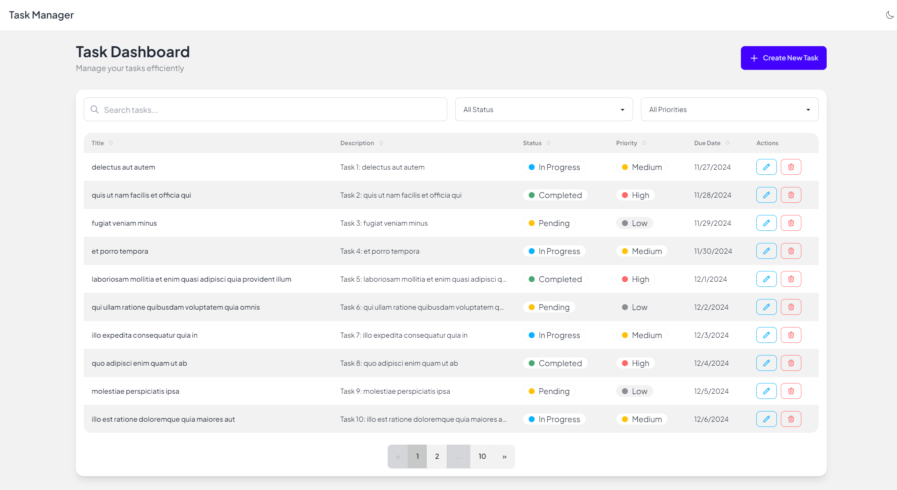
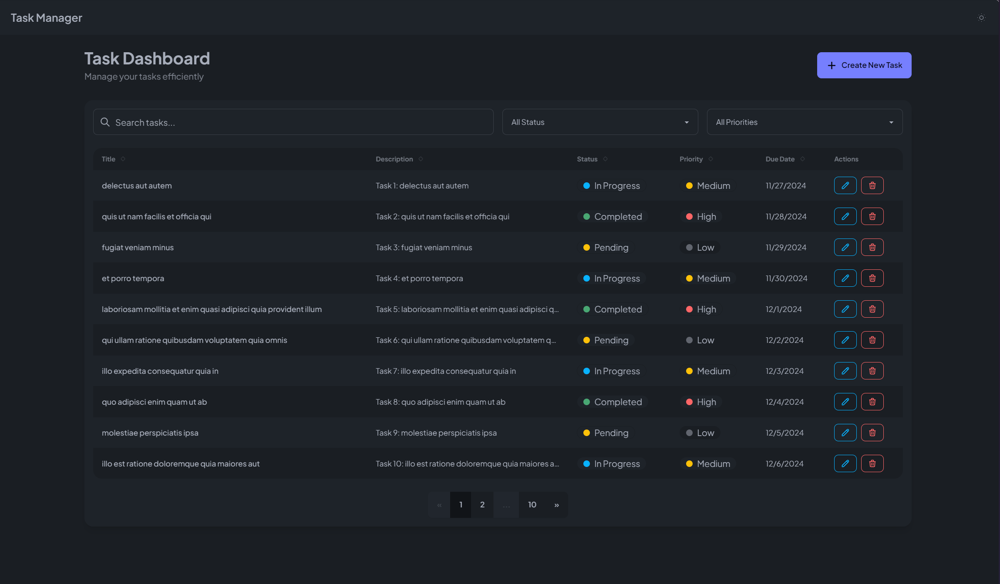
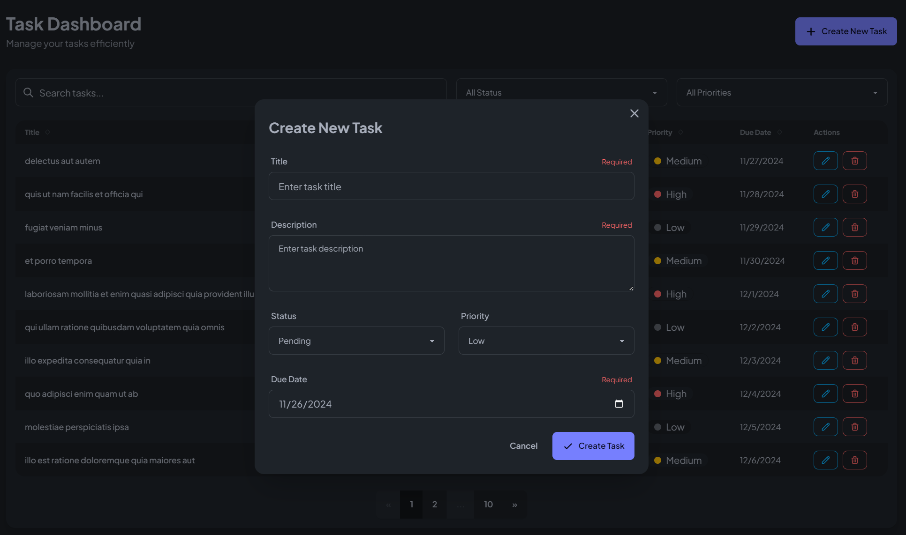
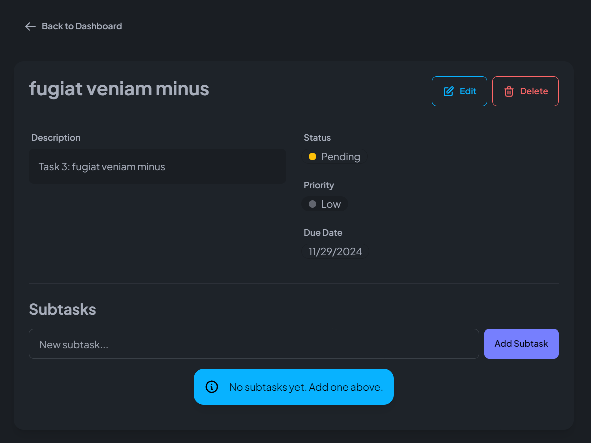

# Vue 3 Task Management Application

A modern task management application built with Vue 3, TypeScript, and Vite.

## 🚀 Screenshots

| Light Theme                                     | Dark Theme                                    |
| ----------------------------------------------- | --------------------------------------------- |
|  |  |

| Task Creation                               | Task Details                                  |
| ------------------------------------------- | --------------------------------------------- |
|  |  |

## 🚀 Features

- Task listing and management
- Loading states
- Toast notifications
- Sorting functionality
- Search and filter functionality
- Error handling and recovery mechanisms
- Responsive design
- Dark mode
- Light mode
- Keyboard navigation
- Unit testing
- Fully accessible meeting the requirements of WCAG 2.1 AA
- Fully typed using TypeScript

## 🛠️ Tech Stack

- Vue 3
- Pinia
- TypeScript
- Vite
- Vue Test Utils (for testing)
- ESLint + Prettier (for code formatting)

## 🔧 Getting Started

1. Install dependencies:

```bash
yarn install
```

2. Run development server:

```bash
yarn dev
```

Visit `http://localhost:5173` to view the application.

## 🌿 Branch Naming Guidelines

### Feature Branch Prefix

- Begin feature branch names with one of `[feature/, bugfix/, hotfix/, task/]`
- Example: `feature/task-123-add-sorting-functionality`

### Formatting Rules

- Use lowercase letters only
- Separate words using hyphens (`-`)
- Keep names concise and descriptive

## 📁 Project Structure

```
src/
├── components/
│   ├── Error/        # Error handling components
│   ├── Loading/      # Loading state components
│   ├── Tasks/        # Task management components
│   └── Toast/        # Toast notification components
├── assets/           # Static assets
├── router/           # Vue Router configuration
├── services/         # API services
├── stores/           # Pinia store modules
├── test/            # Test files
├── composables/      # Composables
├── types/            # TypeScript type definitions
└── views/            # Vue views
```

## 🧪 Testing

Run the test suite:

```bash
yarn test
```

## 💅 Code Formatting

Format your code:

```bash
yarn format
```

Lint your code:

```bash
yarn lint
```

## 🔧 IDE Setup

For the best development experience, I recommend using [VS Code](https://code.visualstudio.com/) with the following extensions:

- Vue Language Features (Volar)
- TypeScript Vue Plugin (Volar)
- ESLint
- Prettier

## ⚠️ Important Notes

- Keep sensitive information out of version control
- Follow the Vue 3 Style Guide for consistent code
- Write tests for new features
- Update documentation when making significant changes

## 📝 License

[MIT](LICENSE)
